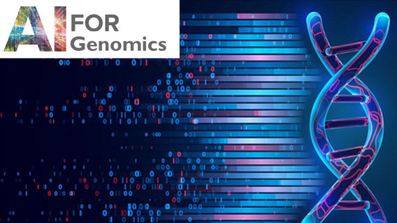

# AI for Genomics

## Instructor

- Dr. Nikolay Oskolkov, Group Leader (PI) at LIOS, Riga, Lativia

## Course overview
This course explores the application of modern AI architectures—Convolutional Neural Networks (CNNs), Long Short-Term Memory networks (LSTMs), and Transformers—to genomic and metagenomic data. Students will gain practical experience through hands-on coding labs and interactive notebooks, learning how to model sequence data, extract biologically meaningful features, and interpret results. Emphasis is placed on real-world applications, including prediction of genomic functional elements, sequence classification and source tracking, as well as biological sequence generation.

## Target audience and assumed background
We assume some basic awareness of UNIX environment, as well as at least beginner level of R and / or Python programming.

## Learning outcomes
By the end of this course, participants will be able to:
- Understand and implement LSTM and CNN architectures for genomic sequence data
- Apply attention mechanisms to improve genomic feature extraction and prediction
- Train simple Transformer models for sequence classification or functional element prediction
- Use notebooks to run and modify ML & DL workflows for genomics research
- Interpret model outputs and assess performance using biological context

---

# Schedule

## Before the course

| Time   | Activity                                                          | Link                                                                                                                                                    |
|--------|-------------------------------------------------------------------|---------------------------------------------------------------------------------------------------------------------------------------------------------|
| ~ 1 h  | Recorded talk: Hub AI Talks: Life Science Meets AI (starting from 59:32)                                                  | [Video](https://www.youtube.com/watch?v=X9J-NlkODmM)                                            |
| ~ 1 h  | In case needed: Recap on Unix                                                                                             | [Lab](command-line-basics.md)                                                                   |
| ~ 1 h  | Useful reading: Deep Learning for Life Sciences: Do we have Big Data in Life Sciences?                                    | [Blog](https://medium.com/data-science/do-we-have-big-data-in-life-sciences-c6c4e9f8645c?sk=34a6924df60feb5c7805e58e6e196034)                                                                                                                                                                                                   |
| ~ 1 h  | Useful reading: Deep Learning for Life Sciences: Why Biology is sceptic toward AI                                         | [Blog](https://medium.com/data-science/why-biology-is-sceptic-towards-ai-176e5747758c?sk=ffd06201fa0cbf3ca60edb69295bf7c5)                                                                                                                                                                                                   |
| ~ 1 h  | Useful reading: Deep Learning for Life Sciences: Deep Learning on ancient DNA                                             | [Blog](https://medium.com/data-science/deep-learning-on-ancient-dna-df042dc3c73d?sk=2ba9fa9810175e860cd538f3443ea08a)                                                                                                                                                                                                   |
| ~ 1 h  | Useful reading: Deep Learning for Life Sciences: Deep Learning for Single Cell biology                                    | [Blog](https://medium.com/data-science/deep-learning-for-single-cell-biology-935d45064438?sk=f5407fc10c171898de1ed9b4d5833914)                                                                                                                                                                                                   |
| ~ 1 h  | Useful reading: Deep Learning for Life Sciences: Deep Learning for data integration                                       | [Blog](https://medium.com/data-science/deep-learning-for-data-integration-46d51601f781?sk=05dc5cd18d4c665acf8656c042d1cb45)                                                                                                                                                                                                   |
| ~ 1 h  | Useful reading: Deep Learning for Life Sciences: Deep Learning for clinical diagnostics                                   | [Blog](https://medium.com/data-science/deep-learning-for-clinical-diagnostics-ca7bc254e5ac?sk=cb26d9eca5644ae19cce383744a8d18f)                                                                                                                                                                                                   |
| ~ 1 h  | Useful reading: Deep Learning for Life Sciences: Deep Learning on Microscopy Imaging                                      | [Blog](https://medium.com/data-science/deep-learning-on-microscopy-imaging-865b521ec47c?sk=fbcc4a5e7ed0e989d9903886fd67bf5e)                                                                                                                                                                                                   |
| ~ 1 h  | Useful reading: Deep Learning for Life Sciences: Deep Learning on Human Microbiome                                        | [Blog](https://medium.com/data-science/deep-learning-on-human-microbiome-7854fba815fc?sk=a6977e48b863688b372c5be3d9ec7409)                                                                                                                                                                                                   |
| ~ 1 h  | Useful reading: Deep Learning for Life Sciences: Deep Learning on Neanderthal Genes                                       | [Blog](https://medium.com/data-science/deep-learning-on-neanderthal-genes-ad1478cf37e7?sk=bae621d1d720688669a019a15db53cfc)                                                                                                                                                                                                   |
| ~ 1 h  | Useful reading: Deep Learning for Life Sciences: LSTM to detect Neanderthal DNA                                           | [Blog](https://medium.com/data-science/lstm-to-detect-neanderthal-dna-843df7e85743?sk=5d32c984ae4a0a4cfb86a73a1d26d8a2)                                                                                                                                                                                                   |

## Day 1: 2 pm - 8 pm Berlin time

| Time           | Activity                                                                                   | Link                                                                                                                                        |
|----------------|--------------------------------------------------------------------------------------------|---------------------------------------------------------------------------------------------------------------------------------------------|
| 14.00 - 14.45  | Course outline and practical information: introductions                                    | [Slides](https://github.com/NikolayOskolkov/Physalia_MLOmicsIntegration_2025/raw/main/slides/course-outline-and-practical-info.pdf)         |
| 14.45 - 15.00  | Break                                                                                      |                                                                                                                                             |
| 15.00 - 16.00  | Introduction to biological Multi-Omics data integration via Machine Learning: key concepts | [Slides](https://github.com/NikolayOskolkov/Physalia_MLOmicsIntegration_2025/raw/main/slides/MachineLearningOmicsIntegration_Oskolkov.pdf)  |
| 16.00 - 16.15  | Break                                                                                      |                                                                                                                                             |
| 16.15 - 17.15  | Feature selection and supervised Omics integration                                         | [Slides](https://github.com/NikolayOskolkov/Physalia_MLOmicsIntegration_2025/raw/main/slides/SupervisedOmicsIntegration_Oskolkov.pdf)       |
| 17.15 - 17.30  | Break                                                                                      |                                                                                                                                             |
| 17.30 - 18.30  | Methods for univariate vs. multivariate feature selection: LASSO, PLS, LDA                 | [Lab](https://html-preview.github.io/?url=https://github.com/NikolayOskolkov/Physalia_MLOmicsIntegration_2025/blob/main/practicals/OmicsIntegration_FeatureSelection.html)                                                                                                                                                                                                                     |
| 18.30 - 18.45  | Break                                                                                      |                                                                                                                                             |
| 18.45 - 20.00  | Methods for supervised Omics integration: mixOmics and DIABLO                              | [Lab](https://html-preview.github.io/?url=https://github.com/NikolayOskolkov/Physalia_MLOmicsIntegration_2025/blob/main/practicals/supervised_omics_integr_CLL.html)                                                                                                                                                                                                                           |

## Day 2: 2 pm - 8 pm Berlin time

| Time           | Activity                                                                                    | Link                                                                                                                                       |
|----------------|---------------------------------------------------------------------------------------------|--------------------------------------------------------------------------------------------------------------------------------------------|
| 14.00 - 15.00  | Unsupervised Omics integration: factor analysis and graph intersection                      | [Slides](https://github.com/NikolayOskolkov/Physalia_MLOmicsIntegration_2025/raw/main/slides/Unsupervised_OmicsIntegration_Oskolkov.pdf)   |
| 15.00 - 15.15  | Break                                                                                       |                                                                                                                                            |
| 15.15 - 16.45  | Methods for unsupervised Omics integration: MOFA1 and MOFA2                                 | [Lab](https://html-preview.github.io/?url=https://github.com/NikolayOskolkov/Physalia_MLOmicsIntegration_2025/blob/main/practicals/UnsupervisedOMICsIntegration_MOFA2.html)                                                                                                                                                                                                                    |
| 16.45 - 17.00  | Break                                                                                       |                                                                                                                                            |
| 17.00 - 18.00  | Applications of artificial neural networks and Deep Learning to biological data integration | [Slides](https://github.com/NikolayOskolkov/Physalia_MLOmicsIntegration_2025/raw/main/slides/DeepLearningOmicsIntegration_Oskolkov.pdf)    |
| 18.00 - 18.15  | Break                                                                                       |                                                                                                                                            |
| 18.15 - 20.00  | Methods for Omics integration via neural networks: Autoencoder                              | [Lab](https://html-preview.github.io/?url=https://github.com/NikolayOskolkov/Physalia_MLOmicsIntegration_2025/blob/main/practicals/DeepLearningDataIntegration.html)                                                                                                                                                                                                                           |

## Day 3: 2 pm - 8 pm Berlin time

| Time           | Activity                                                                                        | Link                                                                                                                                   |
|----------------|-------------------------------------------------------------------------------------------------|----------------------------------------------------------------------------------------------------------------------------------------|
| 14.00 - 15.00  | Dimensionality reduction and Omics integration with UMAP                                        | [Slides](https://github.com/NikolayOskolkov/Physalia_MLOmicsIntegration_2025/raw/main/slides/DimensionReduction_Oskolkov.pdf)          |
| 15.00 - 15.15  | Break                                                                                           |                                                                                                                                        |
| 15.15 - 15.45  | Methods for dimension reduction: comparison between PCA, tSNE, UMAP                             | [Lab](https://html-preview.github.io/?url=https://github.com/NikolayOskolkov/Physalia_MLOmicsIntegration_2025/blob/main/practicals/OmicsIntegration_DimensionReduction.html)                                                                                                                                                                                                                   |
| 15.45 - 16.45  | Graph intersection method and UMAP application to Omics integration                             | [Lab](https://html-preview.github.io/?url=https://github.com/NikolayOskolkov/Physalia_MLOmicsIntegration_2025/blob/main/practicals/UMAP_DataIntegration.html)                                                                                                                                                                                                                                  |
| 16.45 - 17.00  | Break                                                                                           |                                                                                                                                        |
| 17.00 - 18.00  | Batch correction (across samples) and Omics integration (across features) for single cell data  | [Slides](https://github.com/NikolayOskolkov/Physalia_MLOmicsIntegration_2025/raw/main/slides/Single_Cell_Integration_Oskolkov.pdf)     |
| 18.00 - 18.15  | Break                                                                                           |                                                                                                                                        |
| 18.15 - 19.30  | Methods for Omics integration for single cell data: Seurat CCA + DTW, WNN                       | [Lab](https://html-preview.github.io/?url=https://github.com/NikolayOskolkov/Physalia_MLOmicsIntegration_2025/blob/main/practicals/SingleCell_OmicsIntegration.html)                                                                                                                                                                                                                           |
| 19.30 - 20.00  | Questions and discussion                                                                        |                                                                                                                                        |

